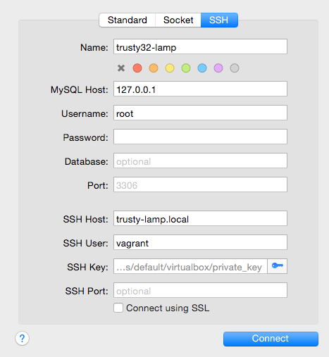

trusty32-lamp-vm
==============

[Instructions if you've used Vagrant before](#box-setup). If
you are new to Vagrant, read on.

**Table of Contents**  *generated with [DocToc](http://doctoc.herokuapp.com/)*

<!-- START doctoc generated TOC please keep comment here to allow auto update -->
<!-- DON'T EDIT THIS SECTION, INSTEAD RE-RUN doctoc TO UPDATE -->


- [Goals](#goals)
- [Choosing between xAMP, Vagrant, and Docker](#choosing-between-xamp-vagrant-and-docker)
- [Box Requirements](#box-requirements)
- [Box Setup](#box-setup)
  - [Optional setup](#optional-setup)
  - [Drupal Installation](#drupal-installation)
- [Basebox Details](#basebox-details)
  - [/etc management](#etc-management)
  - [Permissions](#permissions)
  - [Grub](#grub)
  - ["Unable to mount shared folders" fixed](#unable-to-mount-shared-folders-fixed)
  - [Apache configuration](#apache-configuration)
- [Package highlights](#package-highlights)
- [MariaDB (MySQL) Configuration](#mariadb-mysql-configuration)
- [Changing PHP Versions](#changing-php-versions)
- [PHP Debugging with xdebug](#php-debugging-with-xdebug)
- [PHP Profiling with XHGui](#php-profiling-with-xhgui)
- [Fast database dumps and restores with MySQL Parallel](#fast-database-dumps-and-restores-with-mysql-parallel)
- [Email Configuration](#email-configuration)
- [Drush Alias Autoconfiguration](#drush-alias-autoconfiguration)
- [Verifying basebox integrity](#verifying-basebox-integrity)
  - [Verifying the download when adding the box](#verifying-the-download-when-adding-the-box)
  - [Verifying the box manually](#verifying-the-box-manually)
  - [Validating my identity](#validating-my-identity)
- [Updating baseboxes](#updating-baseboxes)
- [Converting a VirtualBox box to VMWare](#converting-a-virtualbox-box-to-vmware)

<!-- END doctoc generated TOC please keep comment here to allow auto update -->

There are a ton of Vagrant base boxes available for web developers. Or,
Chef / Puppet configurations to take a basic OS install and configure it "just
right". There's two key problems I've run into with other projects:

* Reverse-engineering the configuration to make minor changes took more time to
  make than it would have been to build a box from scratch.
* Many boxes look useful, but aren't signed by a trusted source. How would I
  know that the box wasn't sending off my API keys or code to some random
  server?

With the release of Ubuntu 14.04, I needed to get up to speed on Apache and PHP
configuration anyways. As well, I wanted something that would easily let me do
PHP profiling. So, here's the results of that effort (even though 99% of it is
likely completed elsewhere).

Goals
-----

* < 5 minute setup time for new users.
* Everything you need for most PHP applications.
* XDebug built in for PHP debugging.
* [xhgui](https://github.com/perftools/xhgui) built in and configured for easy
  opt-in profiling.
* [Linux MySQL Manager](https://github.com/Lullabot/lmm) for snapshotting databases.
* [Drush](https://github.com/drush-ops/drush) included for Drupal dev (and out
  of the way for everything else).
* No provisioning whatsoever; treat boxes as "fork and forget" for new projects.

## Choosing between xAMP, Vagrant, and Docker

Deciding what local development environment to choose for you and your team
can be tricky. Here are three options, ordered in terms of complexity:

1. Is your team entirely new to PHP and web development in general? Consider
   using something like [MAMP](https://www.mamp.info) instead of Vagrant or
   Docker.
1. Does your team have a good handle on web development, but are running into
   the limitations of running the site on macOS or Windows? Does your team have
   mixed operating systems including Windows and Linux? Are your production
   database imports locally slowing your team down? This Vagrant box aims to
   address all of these use cases.
1. Is your team using Docker in production, or already maintaining Dockerfiles?
   If so, consider using
   [docker4drupal](https://github.com/wodby/docker4drupal) or similar.

## Box Requirements

If this is your first time you are using Vagrant, you will need:

* Git, to be able to clone this repository. Mac users should update git using
  [Homebrew](http://brew.sh), but it's not required. Windows users can use the
  excellent [Babun](http://babun.github.io) or get Git directly from
  [git-scm.com](https://git-scm.com).
* [VirtualBox](https://www.virtualbox.org), used to run virtual machines. Make
  sure you are using the latest version from the website.
* [Vagrant](https://www.vagrantup.com), the CLI tool to manage virtual
  machines easily. Make sure you are using the latest version from the website.

This Vagrant box will always support the latest versions of VirtualBox and
Vagrant, which are both updated regularly. If you encounter any problems while
following the instructions below, please double-check that you are using the
latest versions of VirtualBox and Vagrant.

Box Setup
---------

1. Clone ```https://github.com/Lullabot/trusty32-lamp.git``` to get the base
   Vagrantfile. Name your clone after your project, such as `~/drupal8`. Create
   new clones of this repository for each different project you work on.

    ```$ git clone https://github.com/Lullabot/trusty32-lamp drupal8```
1. Open up the `Vagrantfile` in your text editor of choice.
   * Each modification in the Vagrantfile is marked with an all-caps header such
     as `PRIVATE NETWORK`. Use this to easily jump around in the file with
     search.
1. Decide on a hostname for your VM.
   * Set a `HOSTNAME` for your VM, such as `drupal8.local`.
     * Your hostname **must end in .local** for automatic DNS to work. If you
       decide to use a different hostname, you will likely need to add a line
       to your `/etc/hosts` with the bridge IP of the VM. This can be found
       by running `ifconfig eth1` on the VM, though you might consider
       configuring a `STATIC_IP` for this in your Vagrantfile instead, as that
       IP may change.
     * If your system does not support ZeroConf / Bonjour (most do)
       * Windows users can install
         [Bonjour for Windows](http://support.apple.com/kb/dl999)
       * Linux users can install ```avahi``` if it's not installed.
       * Or, manually add a line to ```/etc/hosts``` or
         ```C:\Windows\System32\drivers\etc\hosts``` with your desired hostname
         and IP address.
1. Set up `FILE SYNCING` by setting `SYNC_TYPE` and `SYNC_DIRECTORY`.
   * By default Virtualbox syncing and a `www` directory are synced.
   * The only assumption is that whatever is mounted into ```/var/www``` has a
     docroot directory. If your project uses another directory, you can add a
     symlink by running `ln -s <repository docroot> docroot`, or by editing the
     Apache configuration in `/etc/apache2/sites-enabled`.
   * Most users will want to use NFS or rsync.
   * For larger codebases, a significant performance improvement can be seen by
     switching to rsync instead of NFS. Windows users might want to try
     [smb mounting](https://docs.vagrantup.com/v2/synced-folders/smb.html).
1. Boot the VM with ```vagrant up [--provider vmware_fusion]```. The base box
   will be automatically downloaded.
1. Browse to the hostname you choose to see phpinfo or the code you have synced.

### Optional setup

Configure `RESOURCES` to change the defaults of a single CPU core and
512MB of memory. Change `ARCH` under `RESOURCES` to 64 to run a 64-bit box
instead. This will increase the base memory requirements for the box to boot
from around 180MB to 250MB.

You can also [verify your download](#verifying-basebox-integrity). GPG and SHA1
signatures are available in the
[Dropbox folder](https://www.dropbox.com/sh/oy1av6uhod3yeto/Pxuqc9NSFS).
Vagrant will automatically verify the sha1 signature in the base box JSON file.
Unfortunately vagrant won't preserve the raw box after importing it, but for
most uses simply verifying the PGP signature on the sha1 hashes and JSON files
should be enough.

### Drupal Installation

These instructions will be fairly similar for any other PHP app checked out
from git. Most other systems will require a `composer install`, which can be
run from inside the VM or on the host machine.

1. Remove the default docroot directory, since we are going to replace it with a
   Drupal checkout:

    ```
    $ cd www
    $ rm -rfv docroot
    ```

2. Go to drupal.org to clone Drupal 8 to get directions to checkout Drupal. It
   needs to be cloned into the `www/docroot` directory within your project
   directory.

    ```
    $ git clone http://git.drupal.org/project/drupal.git docroot
    ```

Browse to http://drupal8.local and install Drupal. Use root with a blank
password as the MySQL database credentials. The installer will automatically
create a database for you.

Basebox Details
---------------

### /etc management

/etc is managed with etckeeper which is configured to commit to a git
repository. Run ```sudo git log -p``` in /etc to see all of the configuration
changes made since the initial installation.

The git repository for /etc is available at [trusty32-lamp-etc](https://github.com/Lullabot/trusty32-lamp-etc).

### Permissions

The default group for the vagrant user has been changed to www-data. As well,
/var/www is owned by vagrant:www-data.

### Grub

Grub has been configured with a three second delay so it's actually possible to
get to the menu when booting a VM.

### "Unable to mount shared folders" fixed

The VirtualBox additions install to /top, but /sbin/mount.vboxfs expects them
in /usr/lib. <a href="https://forums.virtualbox.org/viewtopic.php?f=3&p=283645">
A symlink has been added</a> from /usr/lib/VBoxGuestAdditions to fix this.

### Apache configuration

Apache is configured to serve ```/var/www/docroot``` as the primary site. That
directory is set to ```AllowOverride All```.

Package highlights
------------------

* LAMP stack composed of
  * Apache 2.4
  * MariaDB 5.5
  * PHP 5.6 and PHP 7.0 (using mod_php)
    * Other PHP versions are installed but not configured
    * See [Changing PHP Versions](#changing-php-versions) to switch versions
  * memcached 1.4
  * redis 2.8
* zsh and oh-my-zsh
* vim-full instead of vim-tiny
* Drush, installed from git into /opt
* xhgui and xdebug

See [PACKAGES.txt](PACKAGES.txt) for the full list.

MariaDB (MySQL) Configuration
-----------------------------

Maria is configured to only listen on localhost, with a passwordless root
account. To connect to the database:

```
$ vagrant ssh # If you aren't already ssh'ed in.
$ mysql -u root -p
```

To connect from an outside tool like Sequel Pro, use your tool's SSH tunnel
configuration. For SSH, use the hostname you set in the Vagrantfile and
`vagrant` as the username and password. You can also use the SSH key placed in
your project's `.vagrant` folder.



Changing PHP Versions
---------------------

Apache and command line PHP by default are configured to use PHP 5.6.x. If you
would like to use, for example, PHP 7.0.x, run the following commands:

```
$ vagrant ssh # If you aren't already ssh'ed in.

# Switch to using PHP 7.0 on the command line
$ sudo update-alternatives --set php /usr/bin/php7.0
# Check to make sure your PHP version is correct now.
$ php -v

# Update Apache to use PHP 7.0 instead of PHP 5.6
$ sudo a2dismod php5.6 && sudo a2enmod php7.0
# Now restart Apache
$ sudo apachectl restart
```

Note: If you've altered anything in php.ini for PHP 5.6, you will need to make
those same changes in `/etc/php/7.0`.

PHP Debugging with xdebug
-------------------------

xdebug is installed and preconfigured to allow remote connections for
debugging. See your editor or IDE for instructions on how to start a
debugging session. For PHPStorm, the [bookmarklet generator](https://www.jetbrains.com/phpstorm/marklets/)
works well.

For CLI and Drush debugging, use the included `php-debug` script to start a
shell with debugging enabled. First grab the host name or IP of your local
machine (for example run `hostname -f`).  Next SSH into your Vagrant box and
run:

```
$ php-debug <hostname of local machine>
```

Next ensure that your debugging client on your local machine is listening for
connections (eg. in PHPStorm: Run > Start Listening for PHP Debug Connections).
Finally run your CLI and Drush commands from the Vagrant box and xdebug should
connect to PHPStorm and allow you to start stepping through.

PHP Profiling with XHGui
------------------------

XHGui is installed to /opt and preconfigured to profile PHP requests. Profiles
are kept for 5 days, and indexes have been added as recommended by the xhgui
setup instructions.

**To start profiling** simply append ```?xhgui=on``` to a request. This will
set a cookie that will keep profiling enabled for the next hour, regardless of
the query parameters. Browse to /xhgui to view your profiles.

It is likely that your project doesn't include the [XHGui code](https://github.com/perftools/xhgui)
that is included to start profiling. When debugging, your IDE might show steps
through this code as unmapped code.

Options include:

* Set a breakpoint within your project, and run to it.
* Or, download XHGui to your machine and add it to the include path in your
  project. Map the XHGui source directory to /opt/xhgui on the "remote"
  machine. The exact configuration for this is IDE dependent.

Fast database dumps and restores with MySQL Parallel
----------------------------------------------------

[MySQL Parallel](https://github.com/deviantintegral/mysql-parallel) is
included to facilitate faster imports and exports of databases. Run
```mysqldumpp``` and ```mysqlrestorep``` for details, or see ```/opt/mysql-parallel```.

Email Configuration
-------------------

Setting up an email system that works in all cases is difficult to do. Some may
need no email at all, while others want email to be forwarded to some other
system. If email is required, try either:

* ```apt-get install postfix mailutils```, followed by selecting local only
  delivery. Mail can then be viewed by running the 'mail' command.
* Redirecting all mail to another address by following "Method 1" over at
  [Oh no! My laptop just sent notifications to 10,000 users](https://www.lullabot.com/blog/article/oh-no-my-laptop-just-sent-notifications-10000-users).

Drush Alias Autoconfiguration
-----------------------------

For Drupal developers, this repository includes a Drush alias that
automatically creates an alias of @HOSTNAME.local. A small snippet must be
included in ~/.drushrc (or ~/.drush/drushrc.php) in the host machine for this
file to be loaded by Drush:

```php
<?php
$dir = getcwd();
while ($dir != '/') {
  if (in_array('site-aliases', scandir($dir))) {
    $options['alias-path'][] = $dir . '/site-aliases';
    break;
  }
  $dir = dirname($dir);
}
```

For advanced networking configurations, simply add a custom alias at the bottom
of aliases.drushrc.php.

Verifying basebox integrity
---------------------------

### Verifying the download when adding the box

```vagrant box add --name=trusty32-lamp --checksum [sha1-from-trusty32-lamp.box.sha1] --checksum-type=sha1 [url-to-box]```

### Verifying the box manually

1. Download the box directly.
1. Download the corresponding .sha1 file.
1. ```shasum -c trusty32-lamp.box.sha1```.

### Validating my identity

1. Download the box directly.
1. Download the corresponding .asc file.
1. ```gpg --recv-keys CEBFC72B # Or download CEBFC72B.asc from dropbox and import it.```
1. ```gpg --verify trusty32-lamp.box.asc```
   * GPG will throw a warning about the signature not being trusted unless you
     or someone else in your web of trust has signed my key.

Updating baseboxes
------------------

1. `vagrant destroy` any existing box in your working directory.
1. Set `USE_INSECURE_KEY` to true in the `Vagrantfile`.
1. Set `PROVISIONING` to true in the `Vagrantfile`.
1. Run `vagrant up`.
1. Run `vagrant provision` until it passes.
1. Run `vagrant reload` to verify any upgraded kernels.
1. Update the Virtualbox guest additions.
1. Push any changes in `/etc/` to https://github.com/Lullabot/trusty32-lamp-etc.
   * Any explicit changes should be manually committed and shared with other
     repository branches.
1. Use `apt-get purge` to remove any old linux-image and linux-header packages to
   save disk space.
1. Run `vagrant reload` just to make sure grub is still working.
1. Run
   `vagrant snapshot push && vagrant ssh --command='sudo /vagrant/test.sh' && vagrant snapshot pop`
   to ensure that the web server, xdebug, and xhgui are working.
1. Run `vagrant ssh -c /vagrant/zero-free-space` to zero free space on the
   disk.
1. Halt the box.
1. Compact the VMDK file with:
   * *Using VMWare:*
     * `/Applications/VMware\ Fusion.app/Contents/Library/vmware-vdiskmanager -d box-disk1.vmdk`<br />
       `/Applications/VMware\ Fusion.app/Contents/Library/vmware-vdiskmanager -k box-disk1.vmdk`
   * *Using compact-vmdk:*
     * Make sure qemu-img is available.
     * `compact-vmdk box-disk1.vmdk`
1. Package the box for:
   * *Virtualbox:* `vagrant package --output trusty32-lamp.box`
   * *VMWare:* `cd <path-to-the-vm> && tar cvf -  ./* | pigz -v > ../trusty64-lamp-vmware.box`
1. `shasum trusty32-lamp.box > trusty32-lamp.box.sha1`
1. Sign the sha1sum with GPG.
`gpg -sabu <your-email> trusty32-lamp.box.sha1`
1. Sign the base box with GPG.
`gpg -sabu <your-email> trusty32-lamp.box`

Converting a VirtualBox box to VMWare
-------------------------------------

_I'm not building VMWare images anymore. If anyone is interested in building
and maintaining them, please open an issue._

While it's easiest to update the existing VMWare base box, sometimes it's
better to update a VirtualBox box and then convert it work with VMWare.

1. `vagrant up` the base box in VirtualBox.
1. Export the virtual machine to an OVF file using the GUI.
1. Import the VM into VMWare, ignoring any warnings.
1. Add a CD drive to the VM.
1. Install VMWare tools.
1. Reboot the VM to verify that the VMWare tools are working correctly.
1. Use `zero-free-space` inside the VM to aid in disk compacting.
1. Halt the VM.
1. Use `vmware-vdiskmanager` as above to defrag and compact each VMDK.
1. Create [metadata.json](https://docs.vagrantup.com/v2/boxes/format.html) inside of the VM package directory.
1. Remove any log or other unneeded files from the package directory.
1. Package the box using the above tar command.
